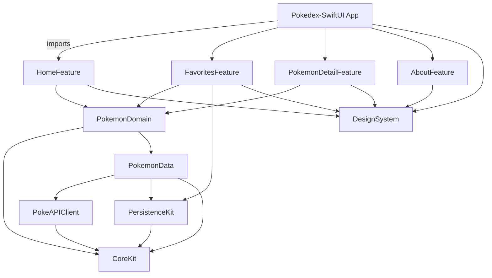

# Pokedex-SwiftUI Architecture

## Goals
- Provide a modular SwiftUI app backed by the public PokeAPI (`https://pokeapi.co/api/v2/`).
- Persist user-selected favourites locally with SwiftData so favourites survive restarts and work offline.
- Use Swift Testing to exercise networking, domain logic, and SwiftUI view models.
- Keep feature modules decoupled via clean boundaries and shared abstractions to ease future expansion.

## Architectural Style
The project follows a modularised MVVM + Use Case architecture:
- **Modules** encapsulate features, shared UI, networking, and persistence. Each module is delivered as an SPM target for composability and controlled dependencies.
- **View models** expose presentation state and intents to SwiftUI views, delegating work to use cases.
- **Use cases** live in the Domain layer and coordinate repositories to satisfy feature needs.
- **Repositories** abstract data sources (network and SwiftData). They expose async APIs that view models use via use cases.
- **SwiftData models** are defined in the persistence module. They mirror domain entities where needed and handle mapping between stored and API models.

```
SwiftUI View → ViewModel → Use Case → Repository → (PokeAPI Client | SwiftData Store)
```

## Package Layout
```
Pokedex-SwiftUI (App target)
└─ Packages/
   ├─ CoreKit
   │  ├─ CoreKit (module)
   │  └─ CoreKitTesting (test support)
   ├─ PokeAPIClient
   │  ├─ PokeAPIClient (network layer)
   │  └─ PokeAPIClientTesting
   ├─ PersistenceKit
   │  ├─ PersistenceKit (SwiftData stack)
   │  └─ PersistenceKitTesting
   ├─ PokemonDomain
   │  ├─ PokemonDomain (use cases + repository protocols)
   │  └─ PokemonDomainTesting
   ├─ PokemonData
   │  ├─ PokemonData (repository implementations & mapping)
   │  └─ PokemonDataTesting
   ├─ DesignSystem
   │  └─ DesignSystem (shared UI components, icons, colors, typography)
   ├─ HomeFeature
   │  ├─ HomeFeature (Home tab views + view models)
   │  └─ HomeFeatureTesting
   ├─ FavoritesFeature
   │  ├─ FavoritesFeature (Favourite tab views + view models)
   │  └─ FavoritesFeatureTesting
   ├─ PokemonDetailFeature
   │  ├─ PokemonDetailFeature (detail flows reused by Home & Favorites)
   │  └─ PokemonDetailFeatureTesting
   └─ AboutFeature
      └─ AboutFeature (static content & metadata)
```

### Module Responsibilities
- **CoreKit**: Shared types (e.g., pagination helpers, error types), schedulers, logging utilities, app-wide constants.
- **PokeAPIClient**: Networking client built with `URLSession`. Defines DTOs for PokeAPI resources (generations, species, pokemon, types, game indices) and exposes async methods to fetch them.
- **PersistenceKit**: SwiftData models (`FavoritePokemonEntity`, `PokemonTypeEntity`, etc.), model container configuration, repository for reading/writing favourites.
- **PokemonDomain**: Domain entities (value-type models), protocols for repositories, and use cases such as `FetchGenerations`, `SearchPokemon`, `ToggleFavorite`, `LoadPokemonDetails`.
- **PokemonData**: Implements repository protocols by orchestrating `PokeAPIClient` and `PersistenceKit`, including caching and mapping.
- **DesignSystem**: Shared SwiftUI components (badge, card, error/empty states), styling tokens, and theming helpers.
- **HomeFeature**: Home tab views (`HomeView`, `GenerationListView`, `PokemonListView`), view models, search coordination, dependency injection wiring for use cases.
- **FavoritesFeature**: Favorites list views, empty state handling, and integration with the detail flow re-exported from `PokemonDetailFeature`.
- **PokemonDetailFeature**: Detail view, view model, local caching of details, favourite toggle button, and formatting utilities for size and weight.
- **AboutFeature**: Presents static app details, credits, API attribution, and technology stack.

## Data Flow & Persistence
1. **Generation browsing**
   - Home view model requests `FetchGenerationsUseCase`.
   - Use case calls `PokemonRepository.generations()` exposed by `PokemonData`.
   - Repository pulls cached data (if available) or calls `PokeAPIClient.fetchGenerations` and caches results if applicable.

2. **Pokemon list per generation**
   - Generation list item navigation triggers `FetchPokemonForGenerationUseCase`.
   - Repository resolves generation species endpoints and hydrates summary models.

3. **Pokemon detail**
   - Detail view model calls `LoadPokemonDetailUseCase`.
   - Repository attempts to load from SwiftData when the Pokemon exists in favourites; if missing or stale, it fetches from PokeAPI, updates SwiftData for favourites, and returns the domain model.

4. **Favourites**
   - `ToggleFavoriteUseCase` writes to SwiftData via `PersistenceKit`.
   - Favourites tab view model subscribes to a SwiftData query publisher (or refreshed fetch) to render the list offline.

## Dependency Management
- Feature modules depend only on `PokemonDomain`, `DesignSystem`, and the specific use cases they require.
- `PokemonData` depends on `PokeAPIClient`, `PersistenceKit`, and `CoreKit`.
- `PokemonDomain` depends on `CoreKit` for shared error types but has no knowledge of concrete implementations.
- Testing targets re-export fixtures and test doubles from sibling `*Testing` modules to avoid duplication.

## API Consumption Strategy
- Use `async/await` networking with structured DTOs.
- Limit payloads by leveraging resource lists and fetching detail endpoints lazily.
- Normalise API responses into domain entities to isolate PokeAPI changes.

## SwiftData Strategy
- Store only favourite pokemon details with embedded types & moves metadata needed for offline display.
- Use lightweight migrations by versioning SwiftData models.
- Provide repository methods for create/read/delete and diffing with remote data to keep local cache consistent.

## Swift Testing Approach
- Unit tests for use cases with repository mocks.
- Integration tests for `PokemonData` using in-memory SwiftData and mocked `URLProtocol` for API.
- Snapshot-style Swift Testing for key SwiftUI views using `@Probed` or `ViewTesting` to ensure layout and state logic (optional but encouraged).
- Contract tests for `PokeAPIClient` to validate decoding against sample fixtures from documentation or recorded responses.

## Navigation & Routing
- Home tab: `NavigationStack` -> Generations -> Pokemon list -> Pokemon detail.
- Favourites tab: `NavigationStack` -> Favourites list -> Pokemon detail (shared view model to avoid duplicate logic).
- About tab: Static `ScrollView` with sections for credits and API usage.
- Dependency injection at app launch wires concrete implementations via environment values or a lightweight container (e.g., `EnvironmentValues.pokemonDependencies`).

## Mermaid Diagram


## Next Steps
1. Initialise the SPM package structure using Xcode or `swift package init --type library` per module.
2. Implement `CoreKit`, `PokeAPIClient`, and `PersistenceKit` scaffolding to unblock domain and feature development.
3. Scaffold Home and Detail flows with mock data to validate navigation before wiring the live API.
